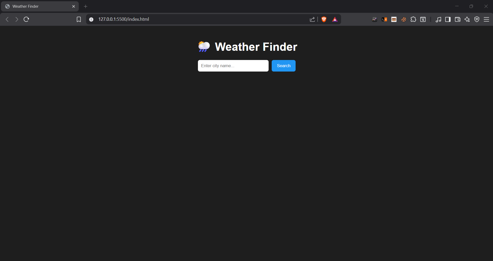
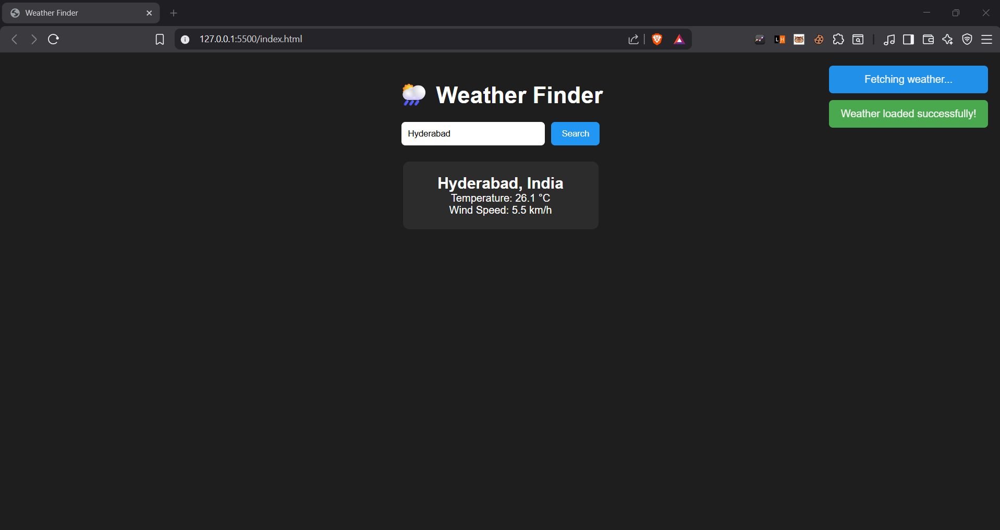
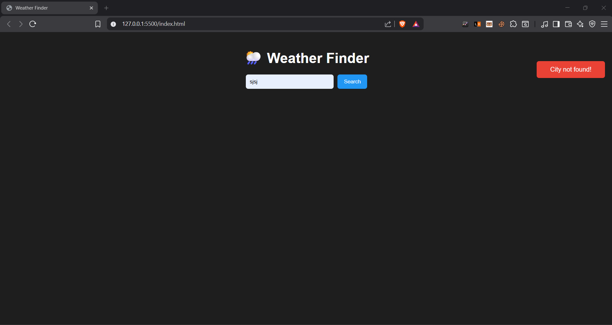

# ToastyWeather

**Project Overview**
- **Description:** ToastyWeather is a small, static web application that fetches current weather information for a user-specified city using the Open‑Meteo public APIs. The UI is minimal and demonstrates use of geocoding and current-weather endpoints, client-side DOM rendering, and lightweight toast notifications.
- **Purpose:** Built as a Weekend Dev Challenge project for CodeChef, intended to be a polished, shareable portfolio piece.

**Demo**

- **Initial UI:**

  

- **Successful city load:**

  

- **Incorrect city / error toast:**

  

**Features**
- **Search by city name** — Geocodes the city and displays the nearest match.
- **Current weather** — Shows temperature (°C) and wind speed (km/h) using Open‑Meteo's current weather feed.
- **User feedback** — Non-blocking toast notifications for status, errors, and success states.
- **Zero-dependency** — Plain HTML, CSS, and vanilla JavaScript (no build step required).

**Repository Structure**
- `index.html` — Application entry point and small runtime injection of the UI.
- `style.css` — Styles for layout, card, and toast notifications.
- `weatherPage.js` — Declarative UI structure used by `index.html` to render the page.
- `script.js` — Application logic: DOM wiring, fetch calls, and toasts.
- `config.example.js` — Example runtime configuration; copy to `secrets.js` to override endpoints or add keys.
- `secrets.js` — (optional, gitignored) Local configuration for endpoints / API keys.
- `Public/` — Screenshots used in this README.

**Configuration**
- The project uses Open‑Meteo public endpoints by default and requires no API key.
- If you need to override endpoints or provide provider-specific keys (for example, when switching to a service that requires a key), copy `config.example.js` to `secrets.js`:

```powershell
cd "c:\Projects\CodeChef Contests\ToastyWeather"
copy .\config.example.js .\secrets.js
# Edit `secrets.js` as needed (it is gitignored by default).
```

**Run Locally**
1. Open the project in a browser (double-click `index.html`) — works for quick checks but may encounter fetch restrictions.
2. Recommended: serve the folder via a static HTTP server to avoid possible local fetch/CORS issues.

PowerShell (Python 3 recommended):
```powershell
cd "c:\Projects\CodeChef Contests\ToastyWeather"
python -m http.server 8000
Start-Process "http://localhost:8000"
```

Alternative (Node.js one-liner):
```powershell
cd "c:\Projects\CodeChef Contests\ToastyWeather"
npx http-server -p 8000
Start-Process "http://localhost:8000"
```

**Publishing**
- To publish on GitHub, initialize a repo and push the files. Example commands:

```powershell
cd "c:\Projects\CodeChef Contests\ToastyWeather"
git init
git add .
git commit -m "Initial commit: ToastyWeather"
git branch -M main
git remote add origin https://github.com/<your-username>/<repo-name>.git
git push -u origin main
```

- To host the static site, enable GitHub Pages in your repository settings or push to a `gh-pages` branch.

**Security & Best Practices**
- Do not commit `secrets.js` or any file containing API credentials. `secrets.js` is included in `.gitignore` by default.
- Use `config.example.js` to document any required config values for contributors.

**License**
- This project is licensed under the MIT License. See the `LICENSE` file for details.

**Contact**
- Project author / maintainer: bled19082005@gmail.com

---
Contributions, issues and feature requests are welcome. Please open a GitHub issue or submit a pull request.

**Contact**
- For questions or feedback: bled19082005@gmail.com
